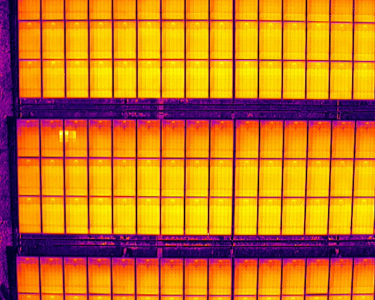
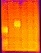
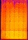

# supervised_solarenergy
final project: Renewable Energy Transportation Technology Based on Artificial Intelligence

## Process
- creating bounding box for original image (ref: https://gist.github.com/bigsnarfdude/d811e31ee17495f82f10db12651ae82d)
  - convert to gray scale
  - threshold: binary_inv + OTSU
  - limited bounding box's width and heigh
- data augument those data
  - horizontal flip
  - vertical flip
  - horizontal shift
  - vertical shift
- training vgg19 with batch_normalize

## dataset
- original img

- abnormal solar panels bounding box

- normal solar panels bounding box

